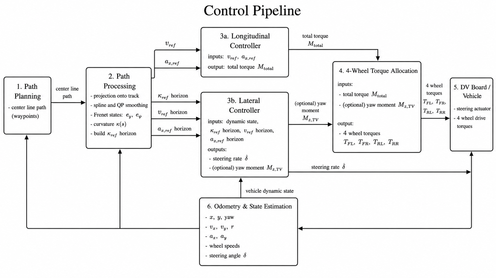

# AGH Racing DV Control

ROS 1 control stack for the AGH Racing Formula Student Driverless car. The
repository contains the controllers for trackdrive/autocross, skidpad and
acceleration together with their ROS messages, configuration and mathematical
documentation.



## Applications

| Package | Mission | Launch file |
|---|---|---|
| `dv_control` | trackdrive and autocross | `control.launch` |
| `dv_skidpad_control` | skidpad | `skidpad_control.launch` |
| `dv_acc_launch_control` | acceleration, launch and braking | `dv_acc_launch_control.launch` |

All applications publish four wheel torques and steering angle on
`/dv_board/control`. Run only one control application at a time.

The lateral controller is the same unbounded LTV MPC in all three
applications. It uses a nonlinear bicycle model for online linearization and
a PT2 steering-actuator model closed with the physical encoder measurement.
The longitudinal reference is mission-specific:

- `dv_control` uses the forward-backward speed profile;
- `dv_skidpad_control` uses the segmented skidpad profile;
- `dv_acc_launch_control` uses the launch/brake map.

Every torque allocator uses the same relaxed wheel-load model. Its
first-order time constant is configured with
`model.mass_transfer.tau_load_s` and defaults to `0.05 s`. Skidpad enables the
four-wheel QP allocator by default.

In acceleration, lateral control becomes active only above
`lateral_control.activation_speed_mps` (`2.0 m/s` by default). Below that
speed the published `steeringAngle_rad` is exactly zero.

## Repository layout

```text
FS-AGH-Racing-DV-Control/
├── interfaces/dv_interfaces/   local ROS messages used by the controllers
├── common/                     shared wheel-load model and tests
├── dv_control/
├── dv_skidpad_control/
├── dv_acc_launch_control/
└── docs/                       equations, architecture and generated PDF
```

`interfaces/dv_interfaces` is a local catkin package containing only the
messages required by the controllers. No external interface repository is
required.

## Requirements

- Ubuntu 20.04
- ROS Noetic
- `catkin_tools`
- a C++17 compiler
- Eigen 3
- nlohmann/json

Install the non-ROS build dependencies:

```bash
sudo apt update
sudo apt install python3-catkin-tools libeigen3-dev nlohmann-json3-dev
```

## Standalone workspace setup

The complete Control stack, including its ROS messages, is built in its own
`~/dv_ws` catkin workspace:

```bash
mkdir -p ~/dv_ws/src
cd ~/dv_ws/src
git clone https://github.com/TymekProstak/FS-AGH-Racing-DV-Control.git

source /opt/ros/noetic/setup.bash
cd ~/dv_ws
catkin init
rosdep install --from-paths src --ignore-src -r -y
catkin build dv_interfaces \
  dv_control dv_skidpad_control dv_acc_launch_control
source devel/setup.bash
```

No Simulator repository, Simulator workspace or catkin overlay is required.
In every new terminal, load only the Control workspace:

```bash
source /opt/ros/noetic/setup.bash
source ~/dv_ws/devel/setup.bash
```

## Run a controller

```bash
roslaunch dv_control control.launch
roslaunch dv_skidpad_control skidpad_control.launch
roslaunch dv_acc_launch_control dv_acc_launch_control.launch
```

A custom acceleration configuration can be selected at launch:

```bash
roslaunch dv_acc_launch_control dv_acc_launch_control.launch \
  config_path:=/absolute/path/to/params.json print_config:=true
```

## Optional external simulator

The Simulator is an independent project and is not cloned, built or launched
by this repository. Combined Control--Simulator launch files are intentionally
not provided.

To use
[`FS-AGH-Racing-DV-Simulator`](https://github.com/TymekProstak/FS-AGH-Racing-DV-Simulator),
build it in its own workspace according to its README. Start the Simulator
from a terminal sourced for the Simulator workspace and start one controller
from a separate terminal sourced for `~/dv_ws`. The user is responsible for
selecting a matching scenario and ensuring that both projects use compatible
ROS topic names and message definitions.

## Main parameters

| Parameter | Default | Scope |
|---|---:|---|
| `model.mass_transfer.tau_load_s` | `0.05 s` | all applications |
| `model.mass_transfer.minimum_wheel_load_N` | `50 N` | all applications |
| `model.body.h1_roll` | `0.08 m` | all applications |
| `model.body.h2_roll` | `0.11 m` | all applications |
| `model.body.lambda_phi_elastic_lateral` | `0.479465...` | all applications |
| `model.ltv_mpc_unbounded.N` | `45` | all applications |
| `general.torque_allocation_lambda_factor` | `0.075` | skidpad QP |
| `general.torque_allocation_fx_ref` | `1000 N` | skidpad QP |
| `general.torque_allocation_mz_ref` | `10 N m` | skidpad QP |
| `lateral_control.activation_speed_mps` | `2.0 m/s` | acceleration |

Vehicle mass, geometry, wheel radius, gear ratio and torque limits must match
the active vehicle configuration before a test.

## Documentation and tests

The complete controller, wheel-load and QP allocator equations are available
in:

- [`docs/controllers_and_allocators.pdf`](docs/controllers_and_allocators.pdf)
- [`docs/controllers_and_allocators.tex`](docs/controllers_and_allocators.tex)

Run the standalone wheel-load test:

```bash
g++ -std=c++17 -O2 -Icommon/include \
  common/test/load_transfer_test.cpp \
  -o /tmp/load_transfer_test
/tmp/load_transfer_test
```

Build the PDF after changing its LaTeX source:

```bash
cd docs
latexmk -pdf controllers_and_allocators.tex
```

## Onboard validation

| Mission | Onboard video | Conditions and result |
|---|---|--- |
| Trackdrive / AutoX | https://drive.google.com/file/d/1iQ14xCbN--fOUGltq9FbUADimelebPyW/view?usp=sharing | N/A |
| Skidpad | https://drive.google.com/file/d/1kSUpFw8NAw3rzDoF6uLLO0cx1T6Uy2w7/view?usp=sharing | 6.2s, ay > 1g |
| Acceleration |  https://drive.google.com/file/d/1p547sPlzSN0OQeuxp0QXSDRByzm592Uv/view?usp=sharing | 4.4s, vmax > 80km/h|

## License

MIT
